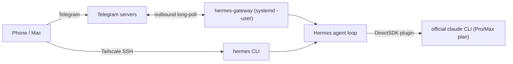

# Hermes Agent Skill

Sets up [Hermes Agent](https://hermes-agent.nousresearch.com/) on an Ubuntu/Debian home server so the user can
talk to it from a phone or any laptop, wherever they are. No router ports are opened: chat apps reach the
gateway through outbound connections, and shell access goes over Tailscale.



---

## 1. When to Activate This Skill

- The user wants Hermes Agent (Nous Research) installed, moved to a new machine, or made reachable remotely.
- The user wants Hermes to run on their Claude subscription instead of a pay-per-token key.
- The Hermes gateway is down, not starting at boot, or answering strangers.

Prerequisite: the server is already reachable over Tailscale (see the `homelab-gateway` skill). If not, do that first.

---

## 2. Workflow

Run `scripts/preflight.sh` first. It reports, without changing anything: OS, RAM, Tailscale state,
lid/sleep settings, systemd linger, whether `claude` and `hermes` are installed and logged in, and whether
the gateway service is running. Show the user the result and skip phases that are already green.

### Phase 1: Keep the server awake (laptops only)

A laptop server suspends when the lid closes or it idles, which kills the gateway.

```bash
sudo mkdir -p /etc/systemd/logind.conf.d
printf '[Login]\nHandleLidSwitch=ignore\nHandleLidSwitchExternalPower=ignore\nHandleLidSwitchDocked=ignore\n' \
  | sudo tee /etc/systemd/logind.conf.d/10-server-lid.conf
sudo systemctl restart systemd-logind
sudo systemctl mask sleep.target suspend.target hibernate.target hybrid-sleep.target
```

Also suggest: keep it on AC power, and enable "power on after AC loss" in BIOS if the machine has it.

### Phase 2: Install Hermes

The installer clones Hermes to `~/.hermes/hermes-agent`, puts `hermes` in `~/.local/bin`, and asks no
questions with `--non-interactive`. On a headless server, skip the desktop computer-use driver.

```bash
curl -fsSL https://hermes-agent.nousresearch.com/install.sh -o /tmp/hermes-install.sh
less /tmp/hermes-install.sh          # read before running
bash /tmp/hermes-install.sh --non-interactive --skip-computer-use
source ~/.bashrc
hermes --version && hermes doctor
```

Some agent harnesses block running a downloaded installer. If yours does, hand the user the commands to run
themselves (in Claude Code: `! bash /tmp/hermes-install.sh ...`) and continue once `hermes --version` works.

### Phase 3: Choose the model provider

#### Option A: Claude Pro/Max subscription (via Claude Code)

Use the **Claude Subscription DirectSDK** plugin. It runs turns through the unmodified, official `claude`
CLI, so usage is billed against the subscription's Agent SDK allowance and no API key is needed.

> [!WARNING]
> Anthropic forbids using subscription OAuth tokens in third-party tools. Do **not** use projects that copy
> or replay Claude Code's OAuth token (e.g. "hermes-claude-auth" style bypasses), and do not point Hermes's
> Anthropic provider at `~/.claude/.credentials.json`. The DirectSDK plugin is the supported route because
> the official CLI makes the calls. Hermes's own issue tracker notes that the built-in Anthropic provider
> with Claude Code OAuth drains paid "extra usage" credits rather than the plan quota.

```bash
claude --version || npm install -g @anthropic-ai/claude-code
claude auth status || claude auth login     # same account as the Pro/Max plan
hermes plugins install claude-subscription-directsdk
hermes config set model.provider claude-subscription-directsdk-experimental
hermes config set model.default sonnet
hermes -z "Reply with just the number: 2+2"   # -z = one-shot; -m only overrides the model
```

Requires Hermes 0.21.4+ (verified on 0.21.5). If `claude` lives somewhere unusual, set `CLAUDE_SUBSCRIPTION_DIRECTSDK_COMMAND`
in `~/.hermes/.env`. The plugin is experimental: no parallel tool calls, no prefill, no JSON-only mode.
Pro plans have tighter limits than Max; long agent sessions can hit the 5-hour cap.

#### Option B: API key

```bash
hermes setup            # interactive: pick Anthropic / OpenRouter / OpenAI and paste a key
chmod 600 ~/.hermes/.env
```

#### Either way

```bash
hermes config set approvals.mode manual   # ask before flagged commands
```

`approvals.mode` is `smart` (default; an extra LLM call judges each flagged command, which also eats
subscription quota), `manual`, or `off`. The older `approval_mode` key is wrong: `hermes config set`
will store it as a stray top-level key and warn "Did you mean: approvals".

### Phase 4: Messaging gateway (Telegram)

1. User messages **@BotFather** → `/newbot` → copies the token.
2. User messages **@userinfobot** → copies their numeric user ID.
3. Append `TELEGRAM_BOT_TOKEN=<token>` to `~/.hermes/.env` (never echo it back or commit it) and
   `chmod 600 ~/.hermes/.env`. Back up `.env` first: the installer already wrote ~10 keys into it.
4. Authorise the user. Either:
   - **Pairing (no ID needed):** user DMs the bot, gets a one-time code, then
     `hermes pairing approve telegram <CODE>`. Manage with `hermes pairing list|revoke`.
   - **Allowlist:** `TELEGRAM_ALLOWED_USERS=<numeric id>` in `.env`.

   Unknown senders are denied by default. Never set `GATEWAY_ALLOW_ALL_USERS=true`: the bot can run
   shell commands on the server.

`hermes gateway setup` does steps 3–4 interactively and covers Discord, Slack, Signal, WhatsApp, Matrix.

### Phase 5: Run on boot

```bash
hermes gateway install                 # user-level systemd unit: hermes-gateway (starts it too)
sudo loginctl enable-linger "$USER"    # start at boot without a login session
systemctl --user enable --now hermes-gateway
systemctl --user status hermes-gateway --no-pager
```

Prefer the user service over `--system`: `hermes update` can then restart it without sudo.

The DirectSDK plugin spawns `claude` from the service, so the unit needs `~/.local/bin` (or wherever
`claude` is) on its `PATH`. If the gateway logs "claude CLI not found", set
`CLAUDE_SUBSCRIPTION_DIRECTSDK_COMMAND=$(command -v claude)` in `~/.hermes/.env` and restart.

### Phase 6: Remote access

- **Chat:** works anywhere the phone has internet; nothing else needed.
- **Full CLI:** if OpenSSH is running, `ssh <user>@<tailscale-hostname>` → `hermes` already works across
  the tailnet. Tailscale SSH (`tailscale set --ssh`) is optional. Turning it on while you are connected over
  SSH drops that session, and Tailscale refuses unless you pass `--accept-risk=lose-ssh`.
- **Dashboard (optional):** `hermes dashboard` binds to localhost. Check its port with
  `hermes dashboard --help`, then either `tailscale serve --bg <port>` or add a Caddy subpath in the
  homelab-gateway Caddyfile. Do not expose it beyond the tailnet.

### Phase 7: Verify

```bash
hermes doctor
systemctl --user is-active hermes-gateway
journalctl --user -u hermes-gateway -n 30 --no-pager
sudo reboot   # optional: confirm the bot answers again after boot without logging in
```

Then have the user message the bot from mobile data (Wi-Fi off) to prove it works away from home, and from a
second Telegram account to confirm strangers are refused.

---

## 3. Operations Cheatsheet

```bash
# Logs / restart
journalctl --user -u hermes-gateway -f
systemctl --user restart hermes-gateway

# Update (back up first)
hermes backup && hermes update && hermes config migrate && hermes doctor \
  && systemctl --user restart hermes-gateway

# Nightly backup at 03:00
(crontab -l 2>/dev/null; echo "0 3 * * * $HOME/.local/bin/hermes backup") | crontab -

# Restore on a new machine
hermes import /path/to/backup.tar.gz

# Review what the agent has taught itself
ls -la ~/.hermes/skills/
```

| Symptom | Check |
| :--- | :--- |
| Bot silent | `systemctl --user status hermes-gateway`; token typo in `.env`; linger off (`loginctl show-user $USER -p Linger`) |
| "not allowed" for you | `TELEGRAM_ALLOWED_USERS` must be the numeric ID, not the @username |
| Harmless log noise | "platform 'teams'/'google_chat' has no valid toolsets" warnings at startup |
| Claude errors / rate limits | `claude auth status`; Pro 5-hour limit reached; run `claude -p hi` as the same user |
| Dies when lid closes | Phase 1 not applied; `systemctl is-enabled suspend.target` should print `masked` |

## Sources

- Hermes docs: https://hermes-agent.nousresearch.com/docs/
- Messaging gateway: https://hermes-agent.nousresearch.com/docs/user-guide/messaging/
- DirectSDK plugin: https://hermes-agent.nousresearch.com/docs/plugins/claude-subscription-directsdk
