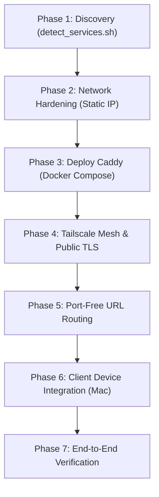

# Homelab Gateway Skill

The **homelab-gateway** skill automates the setup, configuration, and maintenance of a secure, production-grade reverse proxy and remote access gateway for Linux home servers (Ubuntu/Debian) connecting to client devices (macOS, iOS, Windows, Android).

---

## 1. When to Activate This Skill

Activate this skill when:
- The user wants to expose local home server services (Portainer, Cockpit, Jellyfin, Home Assistant, Nextcloud, Plex, Ollama) over secure HTTPS without security warnings.
- Setting up **Caddy** as a reverse proxy via Docker Compose.
- Interconnecting home servers and laptops/Macs using **Tailscale** and **MagicDNS** with official Let's Encrypt TLS certificates.
- Resolving home network issues like shifting DHCP IP addresses, Chrome Secure DNS (`ERR_ADDRESS_UNREACHABLE`), or browser certificate authority trust.
- Eliminating port numbers (`:8443`, `:8080`, `:9000`) in favor of clean custom domain names or subpaths.

---

## 2. Interactive Semi-Automated Workflow

When this skill is activated, follow this 7-phase execution pipeline:



---

### Phase 1: Environment & Service Discovery

1. Execute the packaged discovery script:
   ```bash
   bash ~/.agents/skills/homelab-gateway/scripts/detect_services.sh
   ```
2. Inspect the output to determine:
   - **Primary Network Interface**: (e.g. `eth0` or `wlo1`).
   - **Current LAN IP**: (e.g. `192.168.1.100`).
   - **Default Gateway**: (e.g. `192.168.1.1`).
   - **NetworkManager Profile**: (e.g. `Home-WiFi` or `Wired-Connection`).
   - **Tailscale Status**: Whether installed, logged in, and current tailnet suffix.
   - **Active Docker Containers**: Existing services (Portainer, etc.) and listening ports.
3. Present the discovered environment to the user and confirm the proposed plan:
   - Server LAN IP to lock.
   - Services to expose (e.g. Portainer, Cockpit, Hub).
   - Domain naming scheme.

---

### Phase 2: Host Network Hardening (Static IP)

> [!IMPORTANT]
> Home routers frequently shift IP addresses over DHCP (e.g. lease expiry or reboot). This immediately breaks `/etc/hosts` and DNS records. Always lock the server to a static IP in NetworkManager.

1. Lock the IP permanently on the active connection:
   ```bash
   sudo nmcli con mod "<CONNECTION_NAME>" \
     ipv4.addresses <CURRENT_IP>/24 \
     ipv4.gateway <DEFAULT_GATEWAY> \
     ipv4.dns "<DEFAULT_GATEWAY>,1.1.1.1" \
     ipv4.method manual
   ```
2. Verify:
   ```bash
   nmcli -f ipv4.method,ipv4.addresses,ipv4.gateway,ipv4.dns con show "<CONNECTION_NAME>"
   ping -4 -c 2 1.1.1.1
   ```

---

### Phase 3: Caddy Reverse Proxy Deployment

1. Create directory layout:
   ```bash
   mkdir -p ~/caddy/site ~/caddy/data ~/caddy/config
   ```
2. Deploy `docker-compose.yml` from `~/.agents/skills/homelab-gateway/templates/docker-compose.yml`:
   * Uses `network_mode: host` to eliminate NAT overhead and directly reach `127.0.0.1:<PORT>` services.
   * Mounts persistent `./data` and `./config` to protect against ACME rate limits.
   * Mounts `/var/run/tailscale/tailscaled.sock` for native Tailscale certificate fetching.
3. Copy and populate `templates/index.html` to `~/caddy/site/index.html`.
4. Launch Caddy:
   ```bash
   cd ~/caddy && docker compose up -d
   ```

---

### Phase 4: Tailscale Mesh & Public Let's Encrypt TLS

1. If Tailscale is not installed:
   ```bash
   curl -fsSL https://tailscale.com/install.sh | sudo sh
   sudo tailscale up --operator=$USER
   ```
   Provide the user with the authentication link (`https://login.tailscale.com/a/...`).
2. Rename machine to a clean, memorable hostname (e.g. `home`):
   ```bash
   tailscale set --hostname=home
   ```
3. Prompt user to enable HTTPS certificates in Tailscale admin panel:
   * URL: `https://login.tailscale.com/admin/dns` &rarr; Click **"Enable HTTPS Certificates"**.
4. Verify certificate generation:
   ```bash
   tailscale cert <HOSTNAME>.<TAILNET_SUFFIX>.ts.net
   ```

---

### Phase 5: Port-Free URL Routing (Standard HTTPS Port 443)

Configure `~/caddy/Caddyfile` using `templates/Caddyfile` as the baseline:

1. **Local Access Block** (`.home` / `.local`):
   Uses `tls internal` to generate local self-signed certificates with root CA download at `/root.crt`.
2. **Tailscale Access Block** (`*.ts.net`):
   Uses `tls { get_certificate tailscale }` to request official Let's Encrypt certificates from Tailscale.
3. **Subpath Routing Rules**:
   * **Portainer**:
     ```caddyfile
     redir /portainer /portainer/
     handle_path /portainer/* {
         reverse_proxy 127.0.0.1:9000
     }
     ```
   * **Cockpit**:
     In `/etc/cockpit/cockpit.conf`:
     ```ini
     [WebService]
     Origins = https://<TAILSCALE_DOMAIN> wss://<TAILSCALE_DOMAIN>
     ProtocolHeader = X-Forwarded-Proto
     UrlRoot = /system
     ```
     In Caddyfile:
     ```caddyfile
     redir /cockpit /system/
     redir /cockpit/ /system/
     handle /system* {
         reverse_proxy 127.0.0.1:9090
     }
     ```
4. Reload Caddy:
   ```bash
   cd ~/caddy && docker compose exec caddy caddy reload --config /etc/caddy/Caddyfile
   ```

---

### Phase 6: Client Device Integration (macOS)

Provide the user with the exact client commands for their Mac:

#### Method A: Tailscale (Recommended — Zero Config)
1. Install Tailscale on Mac: `brew install --cask tailscale`.
2. Log into the same Tailscale account.
3. Open `https://<HOSTNAME>.<TAILNET_SUFFIX>.ts.net/` directly in Chrome or Safari.
   * Works everywhere (home Wi-Fi, cellular data, office).
   * 100% valid Let's Encrypt green padlock.
   * Zero `/etc/hosts` changes.
   * Chrome "Use secure DNS" can remain **ON**.

#### Method B: Local LAN Fallback (`.home`)
If connecting strictly over home Wi-Fi without Tailscale:
1. Map hostnames in Mac `/etc/hosts`:
   ```bash
   echo "<LAN_IP> portainer.home cockpit.home server.home" | sudo tee -a /etc/hosts
   sudo dscacheutil -flushcache && sudo killall -HUP mDNSResponder
   ```
2. Trust Caddy's Root CA in macOS System Keychain:
   ```bash
   curl -k https://<LAN_IP>/root.crt -o /tmp/caddy-root.crt && sudo security add-trusted-cert -d -r trustRoot -k /Library/Keychains/System.keychain /tmp/caddy-root.crt
   ```
3. If Google Chrome shows `ERR_ADDRESS_UNREACHABLE`:
   * Chrome's internal Secure DNS (DoH) bypasses `/etc/hosts`. Toggle "Use secure DNS" **OFF** at `chrome://settings/security`, or use Safari.

---

### Phase 7: End-to-End Verification

Verify every endpoint using `curl`:
```bash
# Verify Hub Landing Page
curl -k -I --resolve <DOMAIN>:443:<TAILSCALE_IP> https://<DOMAIN>/

# Verify Portainer Subpath
curl -k -I --resolve <DOMAIN>:443:<TAILSCALE_IP> https://<DOMAIN>/portainer/

# Verify Cockpit Subpath
curl -k -I --resolve <DOMAIN>:443:<TAILSCALE_IP> https://<DOMAIN>/cockpit

# Verify TLS Certificate Issuer
echo | openssl s_client -connect <TAILSCALE_IP>:443 -servername <DOMAIN> 2>/dev/null | openssl x509 -noout -issuer -subject
```
*Expected Issuer for Tailscale*: `O=Let's Encrypt`

---

## 3. Operational Maintenance Cheatsheet

### Caddy
```bash
# Zero-downtime config reload
cd ~/caddy && docker compose exec caddy caddy reload --config /etc/caddy/Caddyfile

# Check live logs
docker logs -f --tail 50 caddy

# Restart container
cd ~/caddy && docker compose restart
```

### Adding a New Homelab Service
1. Open `~/caddy/Caddyfile`.
2. Add a subpath block under the Tailscale site definition:
   ```caddyfile
   redir /<APP> /<APP>/
   handle_path /<APP>/* {
       reverse_proxy 127.0.0.1:<PORT>
   }
   ```
3. Reload Caddy: `cd ~/caddy && docker compose exec caddy caddy reload --config /etc/caddy/Caddyfile`.
4. Access at `https://<TAILSCALE_DOMAIN>/<APP>/` on port 443!

### Tailscale
```bash
# Check peer status
tailscale status

# View daemon logs
journalctl -u tailscaled -n 50 --no-pager
```
